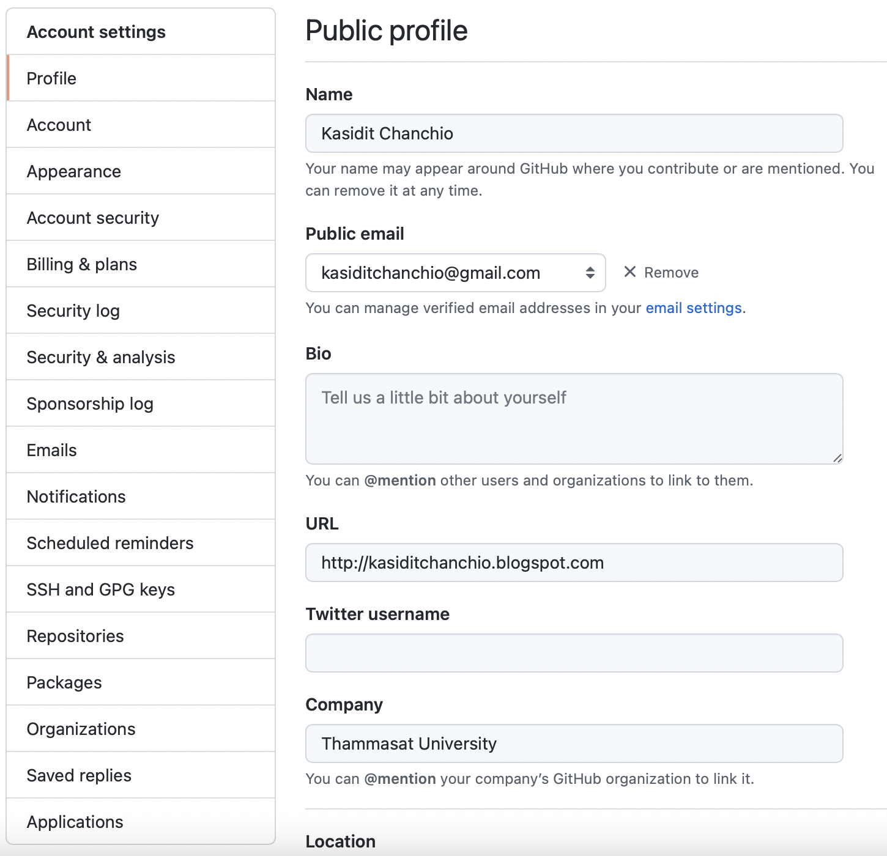
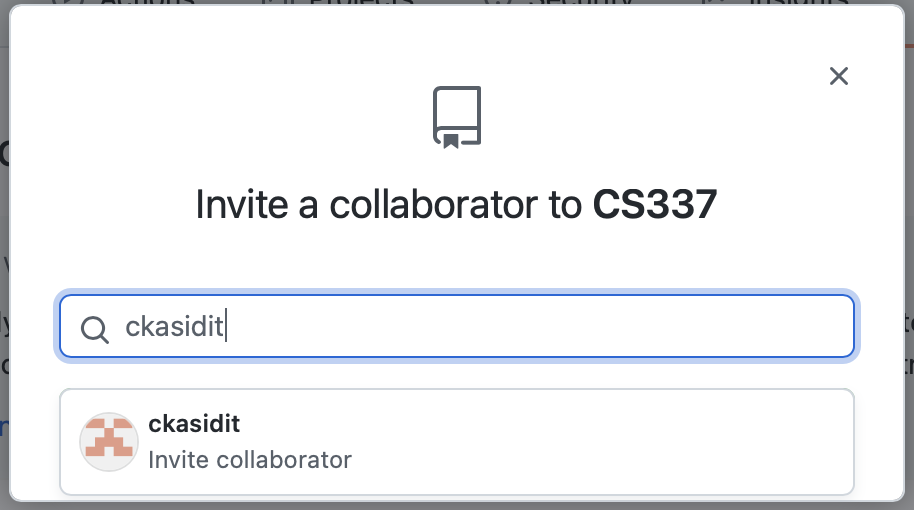
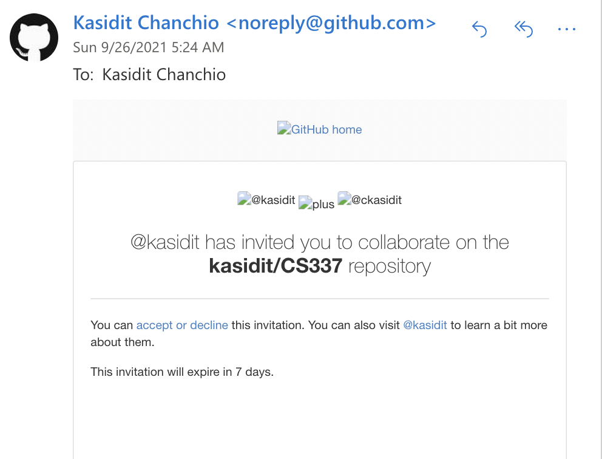

<h1>Notes on Distributed and Parallel Processing</h1>
<ul>
<li> <a href="#simplymake">ทำความเข้าใจโปรแกรม make ขั้นต้น</a>
       <ul>
       <li> <a href="#m1">1. เป้าหมายที่เป็นชื่อไฟล์</a>
       <li> <a href="#m2">2. เป้าหมายที่เป็นชื่อสมมุติ</a>
       <li> <a href="#m3">3. การอ้างอิงชื่อสมมุติและชื่อไฟล์ผสมผสานกันในกฎ</a>
       </ul>
<li> <a href="#github">การสร้าง github repository สำหรับส่ง Assignments</a>
       <ul>
       <li> <a href="#g1">1. สร้างรีโพสิทอรี่ใหม่บนเว็บไซต์ github.com</a>
       <li> <a href="#g2">2. สร้างคู่คีย์ด้วย ssh-keygen</a>
       <li> <a href="#g3">3. นำเข้าพับบลิกคีย์เข้าสู่เว็บไซต์ github</a>
       <li> <a href="#g4">4. สร้างไดเรกทอรี่ที่ต้องการจะ upload ข้อมูล และดาวน์โหลดข้อมูลจากรีโพสิทอรี่</a>
       <li> <a href="#g5">5. upload ข้อมูลสู่ github</a>
       <li> <a href="#g6">6. การ invite ผู้ร่วมงาน collaborator ให้ใช้ไพรเวทรีโพสิทอรี่ได้</a>
      </ul>
<li> <a href="#mpich2">ติดตั้ง MPICH บน ubuntu 20.04</a> 
<li> <a href="#mpich1">ติดตั้ง MPICH บน ubuntu 16.04</a> 
</ul>
<a id="github"><h2>ทำความเข้าใจโปรกรม make ขั้นต้น</h2>

Make เป็นซอฟต์แวร์ของระบบปฏิบัติการ UNIX สำหรับช่วยพัฒนาโปรแกรม โดย Make จะใช้กฎที่ผู้ใช้กำหนดในไฟล์ชื่อ Makefile สำหรับรันคำสั่ง กฎแต่ละกฎที่เขียนใน Makefile จะมีรูปแบบดังนี้คือ 

<pre>
target: prerequisite list 
       commands ...
</pre>

    <i>ภาพ make-1 รูปแบบกฏ </i> 

จากภาพที่ 1 Target คือเป้าหมายของสิ่งที่ผู้ใช้ต้องการให้ make ปฏิบัติ โดยเป้าหมายมีหลายแบบ แต่ในที่นี้เราจะกล่าวถึงเป้าหมายสองแบบได้แก่ 
เป้าหมายที่เป็นไฟล์เป้าหมายที่จะให้ make สร้าง และเป้าหมายแบบโฟนนี่ (phony) คือเป็นเป้าหมายที่เป็นชื่อสมมุติที่ไม่ใช่ชื่อไฟล์ 

<a id="m1"><h3>1. เป้าหมายที่เป็นชื่อไฟล์ </h3> 

เป้าหมายแบบแรกคือเป้าหมายแบบไฟล์ ผู้ใช้จะต้องกำหนดว่าไฟล์เป้าหมายจะเกิดขึ้นได้ต้องมีไฟล์ใดก่อนบ้าง โดยระบุรายการของไฟล์ที่เกิดก่อนทางด้านขวามือ
ของเครื่องหมาย “:” ดังตัวอย่างต่อไปนี้คือ       

<pre>   
hello: hello.c
	gcc -o hello hello
</pre>

       
ซึ่งหมายความว่าการจะสร้างไฟล์ hello ได้นั้นขึ้นอยู่กับไฟล์ hello.c หมายความว่าจะต้องมไฟล์เหล่านี้ก่อนจึงจะสร้างไฟล์ hello ขึ้นมาได้        

กฎข้างต้นมีค่าความจริงสองแบบคือ จริง หรือเท็จ เมื่อ make พบกฎใน Makefile มันจะประเมินว่ากฏแต่ละกฏนั้นเป็นความจริงหรือไม่ 
โดยที่สำหรับกฎที่มีเป้าหมายเป็นชื่อไฟล์ make จะตัดสินว่ากฎนั้นเป็นจริงก็ต่อเมื่อ (1) ไฟล์เป้าหมายและไฟล์ที่ใช้สร้างไฟล์เป้าหมายมีอยู่จริง และ 
(2) ไฟล์เป้าหมายได้ถูกสร้างหรือได้รับการเปลี่ยนแปลงแก้ไขหลังจากไฟล์ที่ใช้สร้างไฟล์เป้าหมายทุกไฟล์ 

ในตัวอย่างของไฟล์เป้าหมาย hello ข้างต้นโปรแกรม make จะตรวจสอบว่ามีไฟล์ hello และถูกไฟล์ที่ระบุทางด้านขวามือของเครื่องหมาย “:” 
คือ hello.c จริงหรือไม่ ถ้าไฟล์ทั้งหมดในกฏมีอยู่จริงและไฟล์ hello.c ถูกสร้างขึ้นก่อนไฟล์ hello ก็จะถือว่ากฎเป็นจริง 

แต่ถ้าไฟล์ใดไฟล์หนึ่งหรือมากกว่าหนึ่งไฟล์ในกฎไม่มี หรือ ไฟล์ทางด้านขวามือของ “:” มีค่าเวลาที่ถูกสร้างหรือถูกเปลี่ยนแปลงใหม่กว่าของไฟล์ 
hello ก็แสดงว่า hello ไม่ได้ถูกสร้างขึ้นมาจากไฟล์ทางด้านขวามือเวอร์ชันปัจจุบัน จากตัวอย่าง hello ข้างต้น ถ้าผู้ใช้เปลื่ยนแปลงแก้ไข 
hello.c หลังจากสร้าง hello แล้ว hello.c ในปัจจุบันก็จะกลายเป็นไฟล์ hello.c เวอร์ชั่นใหม่ ไม่ไช่เวอร์ชั่นเดียวกันที่ใช้สร้าง hello ที่มีอยู่

ในกรณีที่กฎเป็นเท็จ make จะประมวลผลคำสั่ง commands แล้วกลับไปพิจารณากฎอื่นใน Makefile ต่อไป โปรแกรม make 
จะสิ้นสุดการปฏิบัติงานก็ต่อเมื่อทุกกฎที่มีอยู่ใน Makefile ให้ค่าที่เป็นจริง ซึ่งหมายความว่าไฟล์เป้าหมายทุกไฟล์จะต้องใหม่กว่า 
ไฟล์ทุกไฟล์ที่อยู่ทางด้านขวามือของเครื่องหมาย “:” ของกฎสำหรับสร้างไฟล์เป้าหมายเหล่านั้น 

<pre>
$ cat Makefile
hello: hellomain.o hellosub1.o hellosub2.o
	gcc -o hello hellomain.o hellosub1.o hellosub2.o
hellomain.o: hellomain.c
	gcc -c hellomain.c
hellosub1.o: hellosub1.c hello1.h
	gcc -c hellosub1.c
hellosub2.o: hellosub2.c
	gcc -c hellosub2.c
clean: 
	rm hello hellomain.o \
		hellosub1.o hellosub2.o
</pre>

    <i>ภาพ make-2 ตัวอย่างกฏ </i> 

ในตัวอย่างในภาพที่ 2 มีกฎที่มีเป้าหมายเป็นชื่อไฟล์อยู่ 4 กฎดังนี้
<ul>
       <li>กฎข้อที่ 1 มีเงื่อนไขคือ ไฟล์เป้าหมาย hello เกิดขึ้นหลังจากไฟล์ hellomain.o hellosub1.o และ hellosub2.o ถ้าเงื่อนไขนี้เป็นเท็จ โปรแกรม make จะรันคำสั่ง gcc -o hello hellomain.o hellosub1.o และ hellosub2.o เพื่อสร้างไฟล์ hello ขึ้น
       <li>กฎข้อที่ 2 มีเงื่อนไขคือ ไฟล์เป้าหมาย hellomain.o เกิดขึ้นหลังจากไฟล์ hellomain.c ถ้าเงื่อนไขนี้เป็นเท็จ โปรแกรม make จะรันคำสั่ง gcc -c hellomain.c เพื่อสร้างไฟล์ hellomain.o ขึ้น
       <li>กฎข้อที่ 3 มีเงื่อนไขคือ ไฟล์เป้าหมาย hellosub1.o เกิดขึ้นหลังจากไฟล์ hellosub1.c และ hello1.h ถ้าเงื่อนไขนี้เป็นเท็จ โปรแกรม make จะรันคำสั่ง gcc -c hellosub1.c เพื่อสร้างไฟล์ hellosub1.o ขึ้น
       <li>กฎข้อที่ 4 มีเงื่อนไขคือ ไฟล์เป้าหมาย hellosub2.o เกิดขึ้นหลังจากไฟล์ hellosub2.c ถ้าเงื่อนไขนี้เป็นเท็จ โปรแกรม make จะรันคำสั่ง gcc -c hellosub2.c เพื่อสร้างไฟล์ hellosub2.o ขึ้น
</ul>
การประมวลผลกฎของโปรแกรม make จะทำแบบรีเคอร์ชั่น (recursion) คือหลังจากประมวลผลกฏหนึ่งแล้วโปรแกรมจะตรวจสอบกฏอื่นใน Makefile ซ้ำจะกว่ากฎที่มีเป้าหมายเป็นไฟล์ทุกกฎจะเป็นจริง

<a id="m2"><h3>2.  เป้าหมายที่เป็นชื่อสมมุติ</h3> 

โปรแกรม make อนุญาตให้ผู้ใช้เขียนคำสั่งใน Makefile ให้โปรแกรม make ประมวลผลด้วยการกำหนดชื่อเป้าหมายเป็นชื่อสมมุติได้ ซึ่งเมื่อผู้ใช้เรียกใช้โปรแกรม make และกำหนดชื่อสมมุตินี้เป็นอาร์กิวเม้นของโปรแกรม โปรแกรม make จะรันคำสั่งกำกับชื่อสมมุตินั้น 

จากรูปแบบของกฏในภาพที่ 1 ในกรณีที่ชื่อสมมุติอยู่ในตำแหน่งของ target และคำสั่งจะอยู่ในตำแหน่งของ commands เมื่อผู้ใช้เรียกรันโปรแกรม make บนโปรแกรมเชลล์ (shell) โปรแกรม make จะรันคำสั่งใน command ยกตัวอย่างเช่น กฎที่มีชื่อเป้าหมายคือ clean ในภาพที่ 2  เมื่อผู้ใช้ออกคำสั่ง 

<pre>
$ make clean 
</pre>

โปรแกรม make จะรันคำสั่ง rm hello hellomain.o hellosub1.o hellosub2.o 

<a id="m3"><h3>3.  การอ้างอิงชื่อสมมุติและชื่อไฟล์ผสมผสานกันในกฎ</h3> 

โปรแกรม make อนุญาตให้ผู้ใช้อ้างอิงชื่อไฟล์และชื่อเป้าหมายสมมุติในรายการชื่อทางขวามือของเครื่องหมาย “:” (ในส่วนของ prerequisite list ในภาพที่ 1 ได้) โดยที่เราจะแยกพิจารณากรณีดังต่อไปนี้ 

กรณีแรก กำหนดให้เป้าหมายเป็นชื่อสมมุติ และมีรายการชื่อทางด้านขวามือของ “:” เป็นชื่อสมมุติหนึ่งชื่อหรือมากกว่านั้น และไม่ระบุคำสั่ง ดังตัวอย่างของกฎใน Makefile ต่อไปนี้ 

<pre>
x1: x2 x3
x2: 
	echo “hello x2”
x3: 
	echo “hello x3”
</pre>

กำหนดให้ใน Makefile มีกฎที่มีเป้าหมายคือ x1 ซึ่งมีชื่อสมมุติที่อยู่ใน prerequisite list ทางด้านขวามือของ “:” คือชื่อเป้าหมายสมมุติ x2 และ x3 ตามลำดับ เมื่อผู้ใช้รันคำสั่ง make x1 
บนโปรแกรมเชลล์ จะได้ผลดังนี้       

<pre>
$ make x1 
echo “hello x2”
hello x2 
echo “hello x3”
hello x3
</pre>

ซึ่งแสดงว่าโปรแกรม make ได้พิจารณากฎที่มีเป้าหมายคือ x1 โดยที่ก่อนที่จะทำเป้าหมาย x1 ให้เป็นจริงได้จะต้องทำเป้าหมาย x2 และ x3 ให้เป็นจริงก่อน ซึ่งโปรแกรม make จะพิมพ์คำสั่งที่มันประมวลผลเมื่อทำเป้าหมาย x2 คือคำสั่ง echo “hello x2” แล้วจึงรันคำสั่งดังกล่าวทำให้ได้ผลเป็น hello x2 แล้วหลังจากนั้นโปรแกรม make จะทำเช่นเดียวกันกับเป้าหมาย x3

กรณีที่ 2 กำหนดให้เป้าหมายเป็นชื่อสมมุติและมีรายการชื่อทางด้านขวามือของ “:” เป็นชื่อสมมุติหนึ่งชื่อหรือมากกว่านั้น และระบุคำสั่ง ดังตัวอย่างของกฎใน Makefile ต่อไปนี้

<pre>
x1: x2 x3
	echo “hello x1”
x2: 
	echo “hello x2”
x3: 
	echo “hello x3”
</pre>

กรณีนี้ต่างจากกรณีก่อนหน้าคือ มี command ของเป้าหมาย x1 ด้วย เมื่อผู้ใช้รันคำสั่ง make x1 บนโปรแกรมเชลล์ก็จะได้ผลลัพธ์ดังนี้ 

<pre>
$ make x1 
echo “hello x2”
hello x2 
echo “hello x3”
hello x3
echo “hello x1”
hello x1
</pre>

จากผลลัพธ์ที่แสดงบนหน้าจอข้างต้น โปรแกรม make จะประมวลผลตามเป้าหมาย x1 โดยทำเป้าหมายที่เป็น prerequisite ได้แก่ 	x2 และ x3 ให้เสร็จก่อนแล้วหลังจากนั้นจึงประมวลผลคำสั่งของ x1 คือพิมพ์ hello x1 ออกสู่หน้าจอ 

กรณีที่ 3 กำหนดให้เป้าหมายเป็นชื่อสมมุติและมีรายการชื่อทางด้านขวามือของ “:” เป็นชื่อสมมุติหนึ่งชื่อหรือมากกว่านั้น และมีชื่อเป้าหมายที่เป็นชื่อไฟล์หนึ่งชื่อหรือมากกว่านั้น และไม่ระบุคำสั่ง ดังตัวอย่างของกฎใน Makefile ต่อไปนี้

<pre>
x1: x2  x3  hello
x2: 
	echo “hello x2”
x3: 
	echo “hello x3”
hello: hello.c
	gcc -o hello hello.c
</pre>

สมมุติว่าในไดเรกทอรี่มีไฟล์ hello.c แต่ยังไม่มีไฟล์ hello เมื่อออกคำสั่ง make x1 ก็จะได้ผลดังนี้ 

<pre>
$ make x1 
echo “hello x2”
hello x2 
echo “hello x3”
hello x3
gcc -o hello hello.c
</pre>

โปรแกรม make จะประมวลผลเป้าหมาย x1 โดยทำให้เป้าหมาย x2 และ x3 และ hello เป็นจริง ซึ่งถ้าผู้ใช้ออกคำสั่ง make x1 อีกครั้งหนึ่ง โดยที่ไม่มีการเปลี่ยนแปลงไฟล์ hello.c จะได้ผลดังนี้

<pre>
$ make x1 
echo “hello x2”
hello x2 
echo “hello x3”
hello x3
</pre>

ซึ่งโปรแกรม make จะไม่ประมวลผลคำสั่งของกฎที่มีเป้าหมายเป็นชื่อไฟล์คือ hello อีกเพราะกฎนั้นเป็นจริงอยู่แล้ว 

ในกรณีนี้ ผู้ใช้อาจเพิ่มกฎที่มีเป้าหมายเป็นชื่อไฟล์ในส่วนของ prerequisite list ให้มากกว่านี้ก็ได้ 

กรณีที่ 4 กำหนดให้เป้าหมายเป็นชื่อไฟล์และมีรายการชื่อทางด้านขวามือของ “:” เป็นชื่อไฟล์หรือชื่อสมมุติหนึ่งชื่อหรือมากกว่านั้น และมีการระบุคำสั่ง ดังตัวอย่างของกฎใน Makefile ต่อไปนี้

<pre>
hello: hello.c  x1 
	gcc -o hello hello.c
x1: x2  x3 
x2: 
	echo “hello x2”
x3: 
	echo “hello x3”
</pre>

สมมุติว่าไฟล์ hello ไม่มีอยู่ในไดเรกทอรี่ เมื่อผู้ใช้ออกคำสั่ง make hello จะได้ผลดังนี้ 

<pre>
$ make hello 
echo “hello x2”
hello x2 
echo “hello x3”
hello x3
gcc -o hello hello.c
</pre>

ซึ่งหมายความว่าโปรแกรม make จะเข้าไปตรวจสอบความถูกต้องของกฎ hello โดยเช็คว่า hello.c มีอยู่และเข้าไปทำ x1 ซึ่งส่งผลให้เกิดการพิมพ์ hello x2 และ hello x3 บนหน้าจอแล้วหลังจากนั้น ก็สรุปว่ากฎ hello: hello.c x1 เป็นเท็จ เนื่องจาก x1 ไม่ไช่ไฟล์ และไม่มีไฟล์ hello ในไดเรกทอรี่ ดังนั้นโปรแกรม make จะรันคำสั่ง commands ของกฎซึ่งก็คือคำสั่ง gcc -o hello hello.c 

ถัดจากนั้น หลังจากที่ hello ถูกสร้างขึ้นมาแล้ว และไม่มีการเปลี่ยนแปลงไฟล์ hello.c ถ้าผู้ใช้ออกคำสั่ง make hello อีกครั้งหนึ่ง จะได้ผลเช่นเดิมคือ

<pre>
$ make hello 
echo “hello x2”
hello x2 
echo “hello x3”
hello x3
gcc -o hello hello.
</pre>

สาเหตุที่ผลเป็นเช่นนี้ เพราะโปรแกรม make จะตรวจสอบรายการ prerequisite ของเป้าหมาย hello ซึ่งประกอบไปด้วย hello.c และ x1 ซึ่งถึงแม้วาส hello.c จะเก่ากว่า hello แต่การที่ต้องเข้าไปประมวลผลเป้าหมายสมมุติ x1 ทำให้ กฎของเป้าหมาย hello เป็นเท็จ ดังนั้นหลังจากพิจารณา prerequisite เสร็จ โปรแกรม make จึงประมวลผลคำสั่ง gcc -o hello hello.c

<a id="m4"><h3>3.  สรุปการใช้ make เบื้องต้น</h3> 

โปรแกรม make เป็นโปรแกรมที่ช่วยให้โปรแกรมเมอร์สามารถพัฒนาโปรแกรมขนาดใหญ่ได้ 
เราได้กล่าวถึงเป้าหมายสองแบบใน Makefile คือเป้าหมายที่เป็นชื่อไฟล์และเป้าหมาย 
ที่เป็นชื่อสมมุติหรือเป้าหมายแบบโฟนนี่ และอธิบายผลของการอ้างอิงชื่อเหล่านี้ในกฏที่ผู้ใช้ระบุใน Makefile

<a id="github"><h2>การสร้าง github repository สำหรับส่ง Assignments</h2>

ก่อนอื่นผู้อ่านต้องสร้างบัญชีใน github ซึ่งขอให้ศึกษาเองจาก github.com เว็บไซต์ ในโน๊ตนี้เราสมมุติว่าผู้อ่านมีบัญชีใน github แล้ว 
และจะอธิบายการสร้างรีโพสิทอรี่ (repository) ใหม่และ upload ไฟล์เข้าสู่รีโพสิทอรี่นั้น ด้วย ssh โดยผู้เขียนจะบรรยายขั้นตอนดังนี้

<a id="g1"><h3>1. สร้างรีโพสิทอรี่ใหม่บนเว็บไซต์ github.com </h3> 

    ผู้อ่านต้องกดปุ่มเครื่องหมายบวกข้างไอคอนของบัญชีของผู้อ่านและเลือก New repository และเว็บไซด์จะแสดงหน้าเว็บดังภาพ github-1

    <kbd></kbd>

    <i>ภาพ github-1 การสร้างรีโพสิทอรี่ใหม่ </i>  

    หลังจากนั้น บนหน้าเว็บเพจในภาพ github-2 กำหนดค่าชื่อเป็น CS337 และให้เป็น private (โดยที่ผู้อ่านจะสามารถระบุชื่อบัญชีผู้ใช้ระบบ github คนอื่นให้เข้ามาดูหรือร่วมใช้รีโพสิทอรี่นี้ได้ในภายหลัง)
    และกำหนดให้สร้างไฟล์ readme ตั้งแต่แรก สุดท้ายให้กด Create Repository ก็จะได้เว็บเพจดังภาพ github-3

    <kbd></kbd>

    <i>ภาพ github-2 กรอกรายละเอียดรีโพสิทอรี่ใหม่ </i> 

    <kbd></kbd>

    <i>ภาพ github-3 รีโพสิทอรี่ใหม่ </i>  

    หลังจากนั้น ให้ผู้อ่านกดปุ่ม code และเลือกแทบ ssh (ขีดเส้นใต้สีส้ม) ดังภาพ github-4 และจำค่า
<pre>
git@github.com:kasidit/CS337.git
</pre>
เพื่อนำไปใช้อ้างอิงในอนาคต (สามารถเซฟไว้ในคลิบบอร์ดได้)

    <kbd></kbd>

    <i>ภาพ github-4 ชื่อรีโพสิทอรี่แบบ ssh </i>  

<a id="g2"><h3>2. สร้างคู่คีย์ด้วย ssh-keygen </h3>

    ผู้อ่านต้องล็อกอินเข้าสู่เครื่องที่มีข้อมูลที่ต้องการจะอัพโหลดขึ้นสู่ github แล้วออกคำสั่งต่อไปนี้เพื่อสร้างคีย์ ซึ่งผู้เขียนจะสร้างคีย์แบบ ed25519 เนื่องจากมีขนาดเล็กและมีความปลอดภัยสูง โดยที่เราจะกำหนดให้คำสั่ง ssh-keygen จะสร้างไพรเวทคีย์ (private key) และสร้างพับบลิกคีย์ (public key) ไว้ในดีฟอลต์ (default) ไดเรกทอรี่สำหรับยรรจุไฟลืคีย์คือที่ $HOME/.ssh 
<pre>
$ cd $HOME
$ 
$ ssh-keygen -t ed25519 
Generating public/private ed25519 key pair.
Enter file in which to save the key (/home/openstack/.ssh/id_ed25519): 
Enter passphrase (empty for no passphrase): 
Enter same passphrase again: 
Your identification has been saved in /home/openstack/.ssh/id_ed25519
Your public key has been saved in /home/openstack/.ssh/id_ed25519.pub
The key fingerprint is:
SHA256:1KocjsWSet/fXWV8Ws8qHbP1dsvBWOjumZnqqpq8U8M openstack@vm4
The key's randomart image is:
+--[ED25519 256]--+
|                 |
|         .       |
|        . .      |
|     o . .    .. |
|    o = S    . .*|
|   . * E    . *==|
|  . o = .    +.B=|
|   ..o..   .o.Oo=|
|     ==.oo+o+Oo+o|
+----[SHA256]-----+
$ 
</pre>
คำสั่งข้างต้นจะเข้ารหัสไพรเวทคีย์ด้วยพาสเฟส (passphrase) ที่ผู้อ่านป้อนให้ ในกรณีที่ผู้อ่านไม่ใส่พาสเฟส คำสั่ง ssh-keygen ก็จะไม่เข้ารหัสไพรเวทคีย์ (ซึ่งถ้าไฟล์ถูกก็อปปี้โดยผู้ที่ไม่ได้รับอนุญาตไฟล์คีย์ก็จะถูกนำไปใช้ได้เลย) หลังจากนั้น ssh-keygen จะเก็บไพรเวทคีย์ไว้ที่ไฟล์ $HOME/.ssh/id_ed25519 และเก็บพับบลิกคีย์ที่ $HOME/.ssh/id_ed25519.pub

    ผู้อ่านอาจพิมพ์ข้อความพับบลิกคีย์บนหน้าจอเพื่อนำไปใช้ในขั้นตอนต่อไป
<pre>
$ cat $HOME/.ssh/id_ed25519.pub
ssh-ed25519 AAAAC3NzaC1lZDI1NTE5AAAAINOwEGLCh7fsdYsIRxOINEBf3NtnnSOzlSFbg7qdNC77 openstack@vm4
</pre>

<a id="g3"><h3>3. นำเข้าพับบลิกคีย์เข้าสู่เว็บไซต์ github </h3>

    ผู้อ่านสามารถนำเข้าพับบลิกคีย์สู่บัญชีผู้ใช้ github โดยกดปุ่มขยายเมนูที่ไอคอนของบัญชีของผู้อ่านดังภาพที่ github-5 และเลือก Settings

    <kbd></kbd>

    <i>ภาพ github-5 เลือก Settings จากเมนู</i>  

    หลังจากนั้น github จะแสดงเว็บเพจ Settings ดังภาพ github-6 ซึ่งผู้อ่านจะเลือกกด SSH and GPG keys แทบทางด้านซ้ายของเพจ

    <kbd></kbd>

  <i>ภาพ github-6 เว็บเพจ Settings</i> 

 github จะแสดงหน้าจอถัดไปคือแสดงรายการ Keys ที่ผู้อ่านมี ในกรณีที่ผู้อ่านไม่เคยนำเข้า SSH public key ใดมาก่อนก็จะไม่มีรายการคีย์ปรากฏ แต่ถ้าผู้อ่านเคยนำเข้าคีย์ไม่ว่าจะเป็น SSH Keys หรือ GPG Keys มาแล้วก็จะปรากฏรายการของพับบลิกคีย์เหล่านั้นดังตัวอย่างในภาพ github-7 

    <kbd></kbd>

    <i>ภาพ github-7 รายการของพับบลิกคีย์ </i>  

    การที่ผู้อ่านสามารถนำเข้าพับบลิกคีย์ได้หลายไฟล์ หมายความว่าผู้อ่านสามารถดาวน์โหลดและอัพโหลดข้อมูลของรีโพสิทอรี่ของผู้อ่านในบัญชีผู้ใช้ github ของผู้อ่านได้จากคอมพิวเตอร์หลายเครื่อง ในอันดับถัดไป ผู้อ่านจะกดปุ่ม New Ssh Key และหน้าจอจะเปลี่ยนเป็นดังภาพ github-8

    <kbd></kbd>

    <i>ภาพ github-8 ป้อนค่าพับบลิกคีย์ใหม่ </i>  

    ในภาพ github-8 ผู้อ่านต้องก็อปปี้ค่าของพับบลิกคีย์ที่พิมพ์ไว้บนหน้าจอในขั้นตอนก่อนหน้า และนำมาใส่ในช่อง key และในช่องไทเทิ้ล (title) ผู้อ่านจะต้องระบุชื่อคีย์นี้ ซึ่งเป้นชื่อใดก้ได้ แต่ในตัวอย่างผู้เขียนตั้งชื่อให้สะท้อนถึงเครื่องที่จะสามารถใช้งานรีโพสิทอรี่ในบัญชีผู้ใช้ของ github นี้ได้ ซึ่งสมมุติว่าให้เครื่องชื่อ vm4 หลังจากนั้นให้กดปุ่ม Add SSH Key และเว็บไซต์ github จะแสดงหน้าจอดังภาพ github-9 ให้ผู้อ่านป้อนรหัสลับของบัญชีผู้ใช้ github ของผู้อ่าน

    <kbd></kbd>

    <i>ภาพ github-9 คอนเฟิร์มด้วยพาสเวิร์ดของบัญชีผู้ใช้ github </i>  

    เมื่อป้อนรหัสพาสเวิร์ดและผ่านการพิสูจน์ตัวตนและสิทธิ์แล้ว เว็บไซต์ github จะแสดงหน้าจอดังภาพ github-10 ซึ่งเป้นการแจ้งว่าการนำเข้าพับบลิกคีย์ของผู้อ่านเสร็จเรียบร้อย

    <kbd></kbd>

    <i>ภาพ github-10 แสดงรายการคีย์หลังนำเข้าสำเร็จ</i>  

<a id="g4"><h3>4. สร้างไดเรกทอรี่ที่ต้องการจะ upload ข้อมูล และดาวน์โหลดข้อมูลจากรีโพสิทอรี่</h3>

กลับมาที่เครื่องคอมพิวเตอร์ที่ผู้อ่านต้องการอัพโหลดข้อมูลเข้าสู่ github ซึ่งในที่นี้เราสมมุติว่าผู้อ่านต้องการอัพโหลดข้อมูลจากเครื่อง ubuntu ที่ผู้อ่านสร้างคู่คีย์ SSH ก่อนหน้า 
ซึ่งผู้อ่านจะเริ่มต้นจากไดเรกทอรี่ $HOME และสร้างไดเรกทอรี่ย่อยชื่อ CS337 สำหรับเก็บข้อมูลที่ผู้อ่านต้องการจะอัพโหลดเข้าสู่ github รีโพสิทอรี่ CS337 ในบัญชี github 
ของผู้อ่าน และดาวน์โหลดไฟล์และไดเรกทอรี่จากรีโพสิทอรี่นั้นมายังพื้นที่ไดเรกทอรี่ที่สร้างขึ้นบนเครื่อง ubuntu นี้
    

<pre>
$ cd $HOME 
$ mkdir CS337
$ cd CS337
</pre>

เมื่อผู้อ่าน cd เข้าสู่ไดเรกทอรี่ CS337 ผู้อ่านจะต้องออกคำสั่ง git init เพื่อตั้งค่าเริ่มต้นให้ git ซึ่งคำสั่งจะสร้างไดเรกทอรี่ย่อยชื่อ .git ใน CS337 เพื่อเก็บค่า
สถานะการปฏิบัติงานของ github และในอันดับถัดไป ผู้อ่านต้องดาวน์โหลดข้อมูลในรีโพสิทอรี่ในบัญชี github ที่ผู้อ่านต้องการจะอัพโหลดและดาวน์โหลดข้อมูล ซึ่งเนื่องจากผู้อ่านได้สร้าง
รีโพสิทอรี่ CS337 นี้บนเว็บไซต์ github ในขั้นตอนก่อนหน้า ดังนั้นก่อนที่ผู้อ่านจะสามารถอัพโหลดข้อมูลใหม่เข้าสู่รีโพรี่ CS377 จากไดเรกทอรี่ $HOME/CS337 นี้ได้ ผู้อ่านจะต้องทำ
ให้ข้อมูลที่อยู่บน github และบนเครื่องคอมพิวเตอร์ของผู้อ่านเหมือนกันก่อน ด้วยคำสั่งต่อไปนี้
    

<pre>
$ git init
Initialized empty Git repository in /home/openstack/CS337/.git/
$ 
$ git pull git@github.com:kasidit/CS337.git
The authenticity of host 'github.com (20.205.243.166)' can't be established.
RSA key fingerprint is SHA256:nThbg6kXUpJWGl7E1IGOCspRomTxdCARLviKw6E5SY8.
Are you sure you want to continue connecting (yes/no/[fingerprint])? yes
Warning: Permanently added 'github.com,20.205.243.166' (RSA) to the list of known hosts.
<b>Enter passphrase for key '/home/openstack/.ssh/id_ed25519':</b>
remote: Enumerating objects: 3, done.
remote: Counting objects: 100% (3/3), done.
remote: Total 3 (delta 0), reused 0 (delta 0), pack-reused 0
Unpacking objects: 100% (3/3), 584 bytes | 584.00 KiB/s, done.
From github.com:kasidit/CS337
 * branch            HEAD       -> FETCH_HEAD
$
</pre>

    จากคำสั่งที่ใช้ ผู้อ่านจะใช้คำสั่ง git pull เพื่อดาวน์โหลดข้อมูลจากรีโพสิทอรี่ CS337 บน github มายังไดเรกทอรี่ CS337 
ขอให้สังเกตุว่าผู้อ่านต้องใส่ค่า git@github.com:kasidit/CS337.git แทนที่จะเป็น URL ของรีโพสิทอรี่คือ 
https://github.com/kasidit/CS337.git ทั้งนี้เพราะผู้อ่านจะใช้ SSH และคู่คีย์ SSH ในการดาวน์โหลดและอัพโหลด
ข้อมูลระหว่างรีโพสิทอรี่กับไดเรกทอรี่บนเครื่องคอมพิวเตอร์อ่าน ในทางกลับกันถ้าผุ้อ่านต้องการดาวน์โหลดและอัพโหลดด้วยโปรโตคอล https 
ผู้อ่านจะต้่องใช้ URL แต่ผู้เขียนไม่ได้เขียนอธิบายไว้ในที่นี้เนื่องจากการใช้ SSH นั้นปลอดภัยกว่า และมีข่าวว่า github อาจ
ไม่อนุญาตให้ใช้ https อัพโหลดข้อมูลในอนาคต

    ในการดาวน์โหลด github กำหนดให้เราจะใช้คำสั่ง git pull ในขณะที่เราจะต้องใช้คำสั่ง git push ในการอัพโหลด 
ในการดาวน์โหลด เนื่องจากเป็นการติดต่อกับเซิร์ฟเวอร์ของ github ครั้งแรก ssh จึงถามผุ้ใช้ให้คอนเฟิร์มความถูกต้อง แล้วหลังจากนั้น
ก็จะถามหาพาสเฟส เพื่อจะได้นำไปถอดรหัสไพรเวทคีย์เพื่อนำไปใช้สร้างช่องทางเชื่อมต่อที่ถูกเข้ารหัสแบบ ssh ซึ่งคำสั่ง git pull จะดาวน์โหลด
ไฟล์ README.md ซึ่งมีเนื้อหาคือ \# CS337 ในนั้นมาไว้ในไดเรกทอรี่ CS337 

    หลังจากนั้น ผู้อ่านจะสร้างไฟล์ ชื่อ myfirstfile.txt และสร้างไดเรกทอรี่ย่อยชื่อ Assign1 และสร้างไฟล์ file1.txt ในนั้น
    

<pre>
$ ls
README.md
$ cat README.md
# CS337 $ 
$ cat > myfirstfile.txt
Hello World!
for CS337
$ 
$ mkdir Assign1
$ echo "my first assignment" > Assign1/file1.txt
</pre>

<a id="g5"><h3>5. upload ข้อมูลสู่ github </h3>

ในอันดับถัดไป ผู้อ่านต้องใช้คำสั่ง git add เพื่อ add ไดเรกทอรี่และไฟล์ทั้งหมดที่มีการเปลี่บนแปลงใน CS337 นี้เข้าสู่รายการของ
ไฟล์และไดเรกทอรี่ ที่จะได้รับการอัพโหลดเข้าสู่รีโพสิทอรี่ CS337 บน github แล้วหลังจากนั้นต้องใช้คำสั่ง git commit เพื่อคอมมิตรายการ
ไฟล์และไดเรกทอรี่เหล่านั้น 
    

<pre>
$ git add .
$ git commit -m "first update"

*** Please tell me who you are.

Run

  git config --global user.email "you@example.com"
  git config --global user.name "Your Name"

to set your account's default identity.
Omit --global to set the identity only in this repository.

fatal: unable to auto-detect email address (got 'openstack@vm4.(none)')
$ git config --global user.email "kasiditchanchio@gmail.com"
$ git config --global user.name "kasidit"
$ git commit -m "first update"
[master d384b53] first update
 2 files changed, 3 insertions(+)
 create mode 100644 Assign1/file1.txt
 create mode 100644 myfirstfile.txt
$
</pre>

จากคำสั่งข้างต้น ขอให้สังเกตุว่า git add . คือการเพิ่มรายการไฟล์และไดเรกทอรี่ทุกรายการที่อยู่ภายในไดเรกทอรี่ปัจจุบัน 
สำหรับ git commit ออปชั่น -m ตามด้วยข้อความที่ระบุความหมายของการอัพเดทรีโพสิทอรี่แต่ละครั้ง หลังจากใช้คำสั่ง 
git commit เป็นครั้งแรก คำสั่ง git จะแจ้งให้ผู้อ่านระบุข้อมูลชื่อและอีเมล์ของผู้อ่าน และต้องออกคำสั่ง git commit 
อีกครั้งหนึ่ง 

    ในการอัพโหลดข้อมูล ผู้อ่านจะต้องใช้คำสั่ง git remote add เพื่อกำหนดให้คำสั่ง git รู้ว่าจะต้องอัพโหลดข้อมูลไป
ที่ ssh เซิร์ฟเวอร์และรีโพสิทอรี่ใดของ github และให้ชื่อว่าเป็น origin แล้วหลังจากนั้นก็จะออกคำสั่ง git push origin main 
เพื่อกำหนดชื่อ เวอร์ชั่นหลักหรือสาขา (branch) ของรีโพสิทอรี่ CS337 ที่จะอัพโหลดข้อมูลจากไดเรกทอรี่นี้ขึ้นไปว่าชื่อ main 
ซึ่งเป็นสาขาดีฟอลต์
โดยใช้คำสั่งต่อไปนี้ 
    

<pre>
$ git branch -M main
$ git remote add origin git@github.com:kasidit/CS337.git
$ git push origin main
<b>Enter passphrase for key '/home/openstack/.ssh/id_ed25519': </b>
Enumerating objects: 6, done.
Counting objects: 100% (6/6), done.
Delta compression using up to 6 threads
Compressing objects: 100% (2/2), done.
Writing objects: 100% (5/5), 415 bytes | 415.00 KiB/s, done.
Total 5 (delta 0), reused 0 (delta 0)
To github.com:kasidit/CS337.git
   d6017a0..b82769b  main -> main
$
</pre>

ขอให้สังเกตุว่า เมื่อใช้คำสั่ง git push ผู้อ่านจะต้องป้อนพาสเฟสเพื่อถอดรหัสของไพรเวทคีย์
หลังจากนั้น ผู้อ่านสามารถเช็คเว็บไซต์ github ที่รีโพสิทอรี่ CS337 ก็จะเห็นว่าไฟล์จากไดเรกทอรี่ CS337 ถูก
อัพโหลดไปไว้ในนั้นแล้ว ดังภาพ github-11

    <kbd></kbd>

    <i>ภาพ github-11 รีโพสิทอรี่หลังจากคำสั่ง git push</i>  

<a id="g6"><h3>6. การ invite ผู้ร่วมงาน collaborator ให้ใช้ไพรเวทรีโพสิทอรี่ได้ </h3>

สมมุติว่าผู้ใช้บัญชี github ชื่อ kasidit ต้องการให้ผู้ใช้บัญชี github ชื่อ ckasidit สามารถเข้ามาใช้งาน 
รีโพสิทอรี่ CS337 ได้ เว็บไซต์ github มีขั้นตอนดังนี้

    <kbd></kbd>

    <i>ภาพ github-12 กำหนด setting ให้อนุญาตผู้ใช้อื่นเข้าร่วมใช้รีโพสิทอรี่</i>  

    ในอันดับแรก ในภาพ github-12 ผู้อ่านต้องกดแทบ Settings ในหน้าเพจของรีโพสิทอรี่ CS337 ที่ต้องการจะแชร์กับผู้อื่น 
    และจะได้หน้าจอใหม่ในภาพ github-13

    <kbd></kbd>

    <i>ภาพ github-13 ภายใน Settings </i>  

เมื่อเข้าสู่หน้า Setting ผู้อ่านจะเห็นเมนูคำสั่งทางด้านซ้ายให้กดเมนู Manage Access จะเข้าสู่หน้าเว็บเพจ github-14

    <kbd></kbd>

    <i>ภาพ github-14 หลังจากกด Manage Access</i>  

ในภาพ ให้ผู้อ่านกด Invite a collaborator ระบบจะแสดงหน้าเพจดังภาพ github-15 
และผู้อ่านจะระบชื่อบัญชี github ที่จะเชิญซึ่งในตัวอย่างนี้กำหนดให้เป็นบัญชีชื่อ ckasidit

 

    <kbd></kbd>

    <i>ภาพ github-15 ป้อนชื่อบัญชีผู้ใช้ที่จะเชิญให้แชร์ CS337 รีโพสิทอรี่</i>  

เลือกแล้วกด Add ckasidit to this repository ดังภาพ github-16

 

    <kbd></kbd>

    <i>ภาพ github-16 กดเชิญ</i>  

หลังจากนั้น ในช่อง Manage Access บนหน้าเพจของ github จะแสดงรายการ
บัญชีที่เพิ่งเชิญ และระบุว่า pending invite ดังภาพ github-17 เนื่องจากผู้ถูกเชิญยัง
ไม่ได้ตอบรับหรือปฏิเสธ

 

    <kbd></kbd>

    <i>ภาพ github-17 รอการตอบรับ หรือปฏิเสธ</i>  

บนฝั่งของผู้ถูกเชิญ ระบบ github จะส่งอีเมล์ไปให้กับผู้ถูกเชิญ โดยที่
อีเมล์แอดเดรสที่ github ส่งคำเชิญไปจะเป็น อีเมล์ที่ผู้ใช้บัญชี 
ckasidit ใช้สมัครและสร้างบัญชีผู้ใช้บน github

 

    <kbd></kbd>

    <i>ภาพ github-18 อีเมล์ที่ส่งมาให้ผู้ถูกเชิญ</i>  

ในภาพ github-18 ผู้ถูกเชิญต้องกดลิงค์ accept or decline ซึ่งจะนำ
    ผู้ใช้ที่ถูกเชิญ ซึ่งต้องล็อกอินใช้งาน github ภายใต้บัญชีของตนก่อน และระบบ
จะแสดงหน้าเพจในภาพ github-19 ที่จะให้ผู้ถูกเชิญกดเลือก

 

    <kbd></kbd>

    <i>ภาพ github-19 ผู้ถุกเชิญเลือกว่าจะรับหรือปฏิเสธคำเชิญ</i>  

ในกรณีที่ตอบรับ github จะแสดงหน้าเพจของรีโพสิทอรี่ที่ผู้ถูกเชิญได้รับอนุญาต
ให้เข้าถึง ภายใต้ล็อกอินของผู้ถูกเชิญ (บัญชีผู้ใช้ ckasidit ในตัวอย่างนี้) ดังภาพ github-20

 

    <kbd></kbd>

    <i>ภาพ github-20 แสดงหน้าเพจให้ผู้ถุกเชิญเข้าใช้</i>  

สำหรับเจ้าของรีโพสิทอรี่ เมื่อ refresh หน้าเพจ Manage Access อีกครั้งจะเป็นว่า 
Pending Invitation หายไป กลายเป็นผู้ร่วมใช้รีโพสิทอรี่เต็มตัว ดังภาพ github-21

 

    <kbd></kbd>

    <i>ภาพ github-21 รายการผู้ร่วมใช้รีโพสิทอรี่</i>  

ในกรณีที่เข้าของรีโพสิทอรี่ต้องการยกเลิกการเข้าถึงก็สามารถทำได้ทันที
    โดยกดไอคอน ถังขยะ ทางด้านขวาของชื่อผู้ร่วมใช้รีโพสิทอรี่

<a id="g7"><h2>7. สรุปการใช้งาน github เบื้องต้น</h2>

วัตถุประสงค์ของสมุดจดนี้คือการแนะนำให้
ผู้อ่านได้รู้จักเครื่องมือนี้และใช้มันเพื่อส่งงานประกอบการเรียนการสอน
แต่ผู้อ่านสามารถใช้คำสั่ง git  และ บริการของเว็บไซต์ github  
สำหรับการพัฒนาโปรแกรมแได้อีกมาก 

<a id="mpich2"><h2>ติดตั้ง MPICH บน ubuntu 20.04</h2>

 

ผู้อ่านสามารถศึกษาวิธีการเบื้องต้นได้ที่ <a href="https://github.com/kasidit/MPI-tutorial-on-ubuntu-20.04">MPI-tutorial-on-ubuntu-20.04</a>

<a id="mpich1"><h2>ติดตั้ง MPICH บน ubuntu 16.04</h2>

สำหรับ บน  ubuntu  16.04  zผู้เขียนได้เคยทำสมุดจดไว้เบื้องต้นดังนี้ 

ผมสร้างเครื่อง Virtual Machine (VM) จำนวน 2 เครื่องโดยใช้ virtual box โดยที่กำหนดให้แต่ละเครื่องมี vcpu 2 cores และ 2 GB RAM และ network interfaces ดังนี้ 
<ul>
<li>Interface 1: เป็น NAT 
<li>Interface 2: เป็น Host-Only Network และอยู่ใน subnet 192.168.56.0/24
<li>Interface 3: เป็น Internal Network ชื่อ "intnet2"
</ul>
หลังจากติดตั้ง ubuntu 16.04 บน VM ทั้งสองแล้ว ผมเข้าไปกำหนดค่าใน /etc/sudoers เพื่อให้ login id ของผม (ในตัวอย่างนี้ผมใช้ชื่อ account ว่า "openstack") ให้สามารถใช้ sudo ได้โดยไม่ใส่พาสเวิด และผมกำหนด Network interfaces ของ VM เครื่องที่ 1 (VM1) ให้มีค่าดังนี้ ()
<pre>
$ ip link
1: lo: <LOOPBACK,UP,LOWER_UP> mtu 65536 qdisc noqueue state UNKNOWN mode DEFAULT group default qlen 1
    link/loopback 00:00:00:00:00:00 brd 00:00:00:00:00:00
2: enp0s3: <BROADCAST,MULTICAST,UP,LOWER_UP> mtu 1500 qdisc pfifo_fast state UP mode DEFAULT group default qlen 1000
    link/ether 08:00:27:85:09:7e brd ff:ff:ff:ff:ff:ff
3: enp0s8: <BROADCAST,MULTICAST,UP,LOWER_UP> mtu 1500 qdisc pfifo_fast state UP mode DEFAULT group default qlen 1000
    link/ether 08:00:27:94:55:a4 brd ff:ff:ff:ff:ff:ff
4: enp0s9: <BROADCAST,MULTICAST> mtu 1500 qdisc noop state DOWN mode DEFAULT group default qlen 1000
    link/ether 08:00:27:e8:55:24 brd ff:ff:ff:ff:ff:ff
$ 
$ sudo nano /etc/network/interfaces
$ cat /etc/network/interfaces 
# This file describes the network interfaces available on your system
# and how to activate them. For more information, see interfaces(5).
#
source /etc/network/interfaces.d/*
#
# The loopback network interface
auto lo
iface lo inet loopback
#
# The primary network interface
auto enp0s3
iface enp0s3 inet dhcp
#
auto enp0s8
iface enp0s8 inet dhcp
#
auto enp0s9
iface enp0s9 inet static
address 192.168.1.11
netmask 255.255.255.0
network 192.168.1.0
#
$ sudo reboot
</pre>
Reboot เครื่องเพื่อให้ network interface enp0s9 ของ VM1 เป็น 192.168.1.11

สำหรับ VM เครื่องที่ 2 (VM2) ผมกำหนดค่า network configuration ดังนี้ 
<pre>
$ sudo nano /etc/network/interfaces
$ cat /etc/network/interfaces 
# This file describes the network interfaces available on your system
# and how to activate them. For more information, see interfaces(5).
#
source /etc/network/interfaces.d/*
#
# The loopback network interface
auto lo
iface lo inet loopback
#
# The primary network interface
auto enp0s3
iface enp0s3 inet dhcp
#
auto enp0s8
iface enp0s8 inet dhcp
#
auto enp0s9
iface enp0s9 inet static
address 192.168.1.12
netmask 255.255.255.0
network 192.168.1.0
#
$ sudo reboot
</pre>
กำหนดค่า IP บน enp0s9 ของ VM2 ให้เป็น 192.168.1.12

login เข้าไปใน VM ทั้งสองใหม่ ติดตั้ง mpich
<pre>
$  sudo apt install mpich
Reading package lists... Done
Building dependency tree
Reading state information... Done
The following additional packages will be installed:
  g++ g++-5 gfortran gfortran-5 hwloc-nox libcr-dev libcr0 libgfortran-5-dev
  libgfortran3 libhwloc-plugins libhwloc5 libltdl7 libmpich-dev libmpich12
  libpciaccess0 libstdc++-5-dev ocl-icd-libopencl1
Suggested packages:
  g++-multilib g++-5-multilib gcc-5-doc libstdc++6-5-dbg gfortran-multilib
  gfortran-doc gfortran-5-multilib gfortran-5-doc libgfortran3-dbg blcr-dkms
  libhwloc-contrib-plugins libstdc++-5-doc blcr-util mpich-doc opencl-icd
The following NEW packages will be installed:
  g++ g++-5 gfortran gfortran-5 hwloc-nox libcr-dev libcr0 libgfortran-5-dev
  libgfortran3 libhwloc-plugins libhwloc5 libltdl7 libmpich-dev libmpich12
  libpciaccess0 libstdc++-5-dev mpich ocl-icd-libopencl1
0 upgraded, 18 newly installed, 0 to remove and 132 not upgraded.
Need to get 21.0 MB of archives.
After this operation, 79.4 MB of additional disk space will be used.
Do you want to continue? [Y/n]y
....
....
$ 
</pre>
ตดตั้ง NFS server บน VM1 สร้าง mount directory และกำหนดค่า /etc/exports
<pre>
$ sudo apt install nfs-kernel-server
$ 
$ sudo mkdir /nfs
$ sudo vi /etc/exports
$
openstack@cs715host2:~$ cat /etc/exports
# /etc/exports: the access control list for filesystems which may be exported
#               to NFS clients.  See exports(5).
#
# Example for NFSv2 and NFSv3:
# /srv/homes       hostname1(rw,sync,no_subtree_check) hostname2(ro,sync,no_subtree_check)
#
# Example for NFSv4:
# /srv/nfs4        gss/krb5i(rw,sync,fsid=0,crossmnt,no_subtree_check)
# /srv/nfs4/homes  gss/krb5i(rw,sync,no_subtree_check)
#
/nfs   192.168.1.0/24(rw,sync,no_root_squash,no_subtree_check)
$
$ sudo systemctl restart nfs-kernel-server
$
</pre>
ติดตั้ง NFS client บน VM2 และ Remote Mount NFS server และทดสอบโดยการสร้าง directory "mydir"
<pre>
$ sudo apt install nfs-common
$ sudo mkdir -p /nfs
$ sudo mount 192.168.1.11:/nfs /nfs
$
$ cd /nfs
$ sudo mkdir mydir
$ $ ls -l
total 4
drwxr-xr-x 2 root root 4096 May  5 23:51 mydir
$
</pre>
ทดสอบว่า บน VM1 ใน NFS directory มี "mydir" ปรากฏอยู่หรือไม่
<pre>
$ cd /nfs
$ ls -l
total 4
drwxr-xr-x 2 root root 4096 May  5 23:51 mydir
$
</pre>
กำหนดค่าในไฟล์ /etc/fstab บน VM2 ให้ Remote mount ไปยัง NFS directory ตั้งแต่ตอน boot เครื่อง และ reboot เครื่อง
<pre>
$ sudo vi /etcfstab
$ cat /etc/fstab
# /etc/fstab: static file system information.
#
# Use 'blkid' to print the universally unique identifier for a
# device; this may be used with UUID= as a more robust way to name devices
# that works even if disks are added and removed. See fstab(5).
#
# <file system> <mount point>   <type>  <options>       <dump>  <pass>
# / was on /dev/sda1 during installation
UUID=85ddcd59-efed-4a26-936d-d8ca4449a8e8 /               ext4    errors=remount-ro 0       1
# swap was on /dev/sda5 during installation
UUID=47a679a2-11db-4d89-a58b-0b450e79e1a1 none            swap    sw              0       0
192.168.1.11:/nfs    /nfs   nfs auto,nofail,noatime,nolock,intr,tcp,actimeo=1800 0 0
$
$ reboot
</pre>

สร้าง public และ private keys บน VM1
<pre>

</pre>

